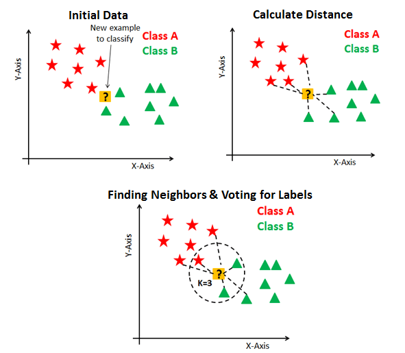

# statistics project

## course code: SBE 2240 

## team 28

| Name                | Section | BN  |
| ------------------- | ------- | --- |
| Ali Mohamed         | 1       | 59  |
| Mahmoud Tarek Sayed | 2       | 26  |
| Mina Safwat Sami    | 2       | 44  |
| Shehab Mohamed      | 1       | 50  |

### About Dataset

This dataset is originally from the National Institute of Diabetes and Digestive and Kidney Diseases. The objective of the dataset is to diagnostically predict whether or not a patient has diabetes, based on certain diagnostic measurements included in the dataset.

### K-Nearest Neighbors Classifier (KNN)

#### what is KNN?

* K-NN algorithm assumes the similarity between the new case and available cases and put the new case into the category that is most similar to the available categories.
* K-NN algorithm stores all the available data and classifies a new data point based on the similarity. This means when new data appears then it can be easily classified into a well suite category by using K- NN algorithm.

#### how does KNN work?

* Step-1: Select the number K of the neighbors
* Step-2: Calculate the Euclidean distance of K number of neighbors
* Step-3: Take the K nearest neighbors as per the calculated Euclidean distance.
* Step-4: Among these k neighbors, count the number of the data points in each category.
* Step-5: Assign the new data points to that category for which the number of the neighbor is maximum.
* Step-6: Our model is ready.  

